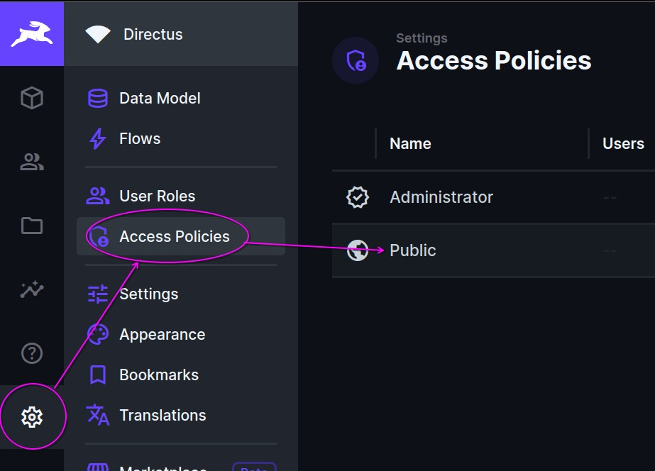
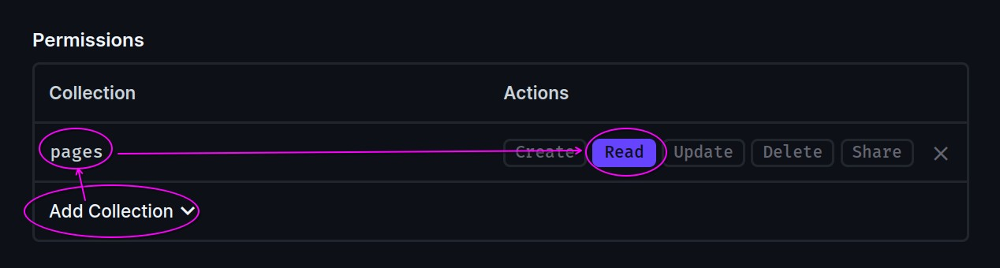
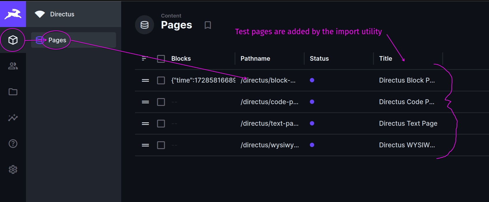

# Deploy Meltdown with Directus Headless CMS

[Meltdown](https://meltdown.dex.yachts) + [directus](https://directus.io)

```sh
git clone https://github.com/the-syndrome/meltdown-with-directus.git
cd meltdown-with-directus
touch database/data.db
git clone https://github.com/the-syndrome/meltdown.git app
cp -r pages/* app/src/pages
cp .env.example .env
docker-compose up
```

By default these services will be up but there are no collections or pages in it yet.

+ directus <http://127.0.0.1:33764> login with `ADMIN_EMAIL` + `ADMIN_PASSWORD` in your `.env` file
+ meltdown <http://127.0.0.1:33765>

To automatically use the test pages import them with:

```sh
npm install --ignore-scripts
npm rebuild esbuild
npm run schema-import
npm run pages-import
```

Until we can automate it the public user needs access to the `pages` collection.

1. <http://127.0.0.1:33764/admin/settings/policies>
2. Public
3. Permissions ➡️ Add Collection: `pages`
4. Actions  ➡️ `Read`





## Next steps

### Edit pages



### Configure Meltdown

If you're finding it useful you can begin to change the values in the `.env` file documented at <https://meltdown.dex.yachts/deploy/environment>. It's recommended to change the admin information before moving to production. [SSG](https://meltdown.dex.yachts/features/ssg) is particularly useful when deploying.

### Configure directus

Directus has flexible configuration allowing for any scale. In this project we run it minimally with sqlite but you can opt for other databases, caching, cloud services, and email. [See all directus config options](https://docs.directus.io/self-hosted/config-options.html).

### Proxying

In this example we only used a basic type of proxying to request pages. If you get committed to directus and want to go deeper you can implement a proxy. The module [http-proxy-middleware](https://github.com/chimurai/http-proxy-middleware) will be fine in development. In production `proxy_pass` in nginx or the equivalent in your HTTP server will help serve more from directus like collections, assets, and the rest.

### Security

Before going to production the developer should check that secrets from the `.env` file are not leaked through to the imba bundle.

### Backup your schema

```sh
npm run schema-export
```

`./tools/schema-{timestamp}.json` is created

### Backup your pages

```sh
npm run pages-export
```

`./tools/pages-{timestamp}.json` is created

### Directus CLI

As an aside there is a tool that directus has for exporting and importing but while using that system there were some problems. The `./tools` scripts were created as a work-around. If you have the ability to troubleshoot and improve this project using the built-in tools we can update with your PR.

```sh
# export
docker-compose exec directus npx directus schema snapshot ./snapshot.yaml

# import
docker-compose exec directus npx directus schema apply --yes ./snapshot.yaml
docker-compose exec directus npx directus schema diff --yes ./snapshot.yaml
```

## Resources

The following docs and guides were helpful to make the project, export, and import.

+ [Directus Export Schema Guide](https://www.restack.io/docs/directus-knowledge-directus-export-schema-guide)
+ [Directus Database Migration](https://www.restack.io/docs/directus-knowledge-directus-database-migration)
+ [Directus API: Schema](https://docs.directus.io/reference/system/schema)
+ [Directus API: Collections](https://docs.directus.io/reference/system/collections)
+ [Directus API: items](https://docs.directus.io/reference/items)
+ [Meltdown docs](https://meltdown.dex.yachts)

## Troubleshooting

### File or directory is read-only

In some containers and runtimes the users and permissions aren't clear so you can set read+write for all as a work-around.

```sh
chmod -R 0777 database extensions uploads
```

### Reach out for help

Join the [Community](https://meltdown.dex.yachts/community)